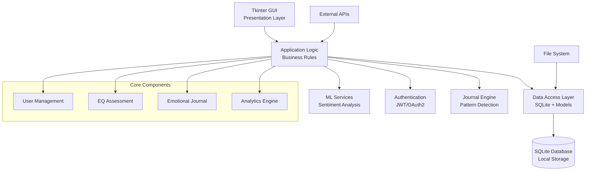

# 🧠 Soul Sense EQ Test

[GitHub Repository](https://github.com/nupurmadaan04/SOUL_SENSE_EXAM)

**A comprehensive Emotional Intelligence assessment platform with AI-powered insights, journaling, and multi-language support.**

[](https://www.python.org/)
[](LICENSE)
[](tests/)


## 📋 Table of Contents

- [Overview](#-overview)
- [Architecture](#-architecture)
- [Key Features](#-key-features)
- [Quick Start](#-quick-start)
- [Installation](#-installation)
- [Usage](#-usage)
- [Development](#-development)
- [Testing](#-testing)
- [Contributing](#-contributing)
- [FAQ](#-faq)
- [License](#-license)

---

## 🎯 Overview

Soul Sense EQ Test is a desktop-based Emotional Intelligence (EQ) assessment application that combines traditional psychometric testing with modern AI capabilities. Built with Python, Tkinter, and SQLite, it provides users with comprehensive EQ evaluation, daily journaling with sentiment analysis, and personalized emotional insights.

### What Makes Soul Sense Different

- **Evidence-Based Assessment**: Grounded in established EI theory (Salovey & Mayer, 1990; Goleman, 1995)
- **AI-Powered Analysis**: Real-time sentiment analysis and pattern detection
- **Multi-Language Support**: English, Hindi (हिंदी), and Spanish (Español)
- **Privacy-First**: All data stored locally with user consent
- **Research-Driven**: Incorporates findings from expressive writing and emotional processing research

---

## 🏗️ Architecture



### System Components

| Component              | Technology         | Purpose                                  |
| ---------------------- | ------------------ | ---------------------------------------- |
| **Frontend (Desktop)** | Tkinter            | User interface for desktop users         |
| **Frontend (Web)**     | Next.js            | Modern web client (React/TS)             |
| **Backend**            | Python/FastAPI     | REST API for web/mobile clients          |
| **Database**           | SQLite             | Local data persistence                   |
| **ML Engine**          | NLTK, scikit-learn | Sentiment analysis and pattern detection |
| **Auth System**        | bcrypt, JWT        | Secure user authentication               |
| **Migration System**   | Alembic            | Database schema management               |

### Data Flow

```
User Input → GUI Events → Business Logic → Data Validation → Database → Response → UI Update
```

---

## ✨ Key Features

### Core Assessment

- ✅ 4-point Likert scale EQ evaluation
- ✅ Age-appropriate question filtering
- ✅ Real-time score calculation
- ✅ Comprehensive result interpretation

### AI & Analytics

- **Sentiment Analysis**: NLTK VADER integration for emotional tone detection
- **Pattern Recognition**: Stress indicators, growth mindset, self-reflection tracking
- **Outlier Detection**: Statistical analysis using Z-score, IQR, and ensemble methods
- **Trend Analysis**: Emotional journey visualization over time
- **ML Integration**: Custom model training on user data
- **Benchmarking**: Population-level EQ score comparisons

### User Experience

- **Multi-language**: English, Hindi, Spanish with easy switching
- **Daily Journal**: AI-powered emotional reflection with personalized insights
- **AI Prompts**: Personalized journaling suggestions based on emotional patterns
- **Rich Profiles**: Medical history, personal details, strengths assessment
- **Secure Authentication**: bcrypt password hashing with JWT tokens
- **Settings Sync**: Cross-device preference synchronization
- **Data Management**: Backup, restore, and data export capabilities (JSON/text formats)

### Developer Experience

- 🧪 **Comprehensive Testing**: Pytest suite with isolated databases
- 🔄 **Database Migrations**: Alembic-powered schema evolution
- 🐳 **Container Ready**: Docker support for consistent environments
- 📖 **API Documentation**: OpenAPI/Swagger documentation

---

## 📦 Installation

### 1. Clone Repository

```bash
git clone https://github.com/nupurmadaan04/SOUL_SENSE_EXAM
cd soul-sense-Exam/SOUL_SENSE_EXAM
```

### 2. Virtual Environment (Recommended)

```bash
# Create
python -m venv .venv

# Activate (Windows)
.venv\Scripts\Activate.ps1

# Activate (macOS/Linux)
source .venv/bin/activate
```

### 3. Install Dependencies

```bash
pip install -r requirements.txt
```

### 4. Initialize Database

```bash
# Run migrations
alembic upgrade head

# Seed question bank
python scripts/setup/seed_questions_v2.py
```

## 🚀 Running the Application

Follow these steps to start the full stack environment.

### 1. Start Backend API (Required)

Start the REST API server first, as other components depend on it.

```bash
# Run from project root
python -m uvicorn backend.fastapi.api.main:app --reload
```

_API will be available at: http://localhost:8000_

### 2. Start Web Frontend

Run the modern web interface.

```bash
cd frontend-web
npm install  # First time only
npm run dev
```

_Access the web app at: http://localhost:3005_

### 3. Start Desktop App (Optional)

Run the standalone desktop GUI.

```bash
# Open new terminal in project root
python -m app.main
```

> [!NOTE]
>
> - **Backend Guide**: Architecture and API details: [backend/fastapi/API_README.md](backend/fastapi/API_README.md)
> - **Frontend Guide**: Web setup and standards: [frontend-web/README.md](frontend-web/README.md)
> - **API Docs**: Interactive Swagger UI: http://localhost:8000/docs

---

## 🎮 Usage

### For Users

1. **Launch**: Run `python -m app.main`
2. **Language**: Select your preferred language from the dropdown
3. **Authentication**: Register or login to your account
4. **Assessment**: Take the EQ test with age-appropriate questions
5. **Results**: View your scores and AI-powered insights
6. **Journal**: Write daily reflections with sentiment analysis
7. **Profile**: Manage your personal and medical information

### For Developers

#### API Usage

```python
import requests

# Get questions for age 25
# Note: Ensure backend is running on port 8000
response = requests.get("http://localhost:8000/api/v1/questions?age=25&limit=10")
questions = response.json()

# Authenticate and create journal entry
auth = requests.post("http://localhost:8000/api/v1/auth/login", data={
    "username": "testuser",
    "password": "password123"
})
token = auth.json()["access_token"]

headers = {"Authorization": f"Bearer {token}"}
journal = requests.post("http://localhost:8000/api/v1/journal", headers=headers, json={
    "content": "Today was productive but stressful...",
    "tags": ["work", "stress"]
})
```

#### CLI Tools

```bash
# Admin interface
python scripts/admin_interface.py

# Database management (Backup)
python -m app.db_backup

# Analytics
python scripts/outlier_analysis.py --user john_doe
```

---

## Development

### Project Structure

```
SOUL_SENSE_EXAM/
├── app/                     # Core application
│   ├── main.py             # Tkinter GUI entry point
│   ├── cli.py              # Command-line interface
│   ├── config.py           # Configuration management
│   ├── db.py               # Database connection
│   ├── models.py           # SQLAlchemy models
│   ├── auth.py             # Authentication logic
│   ├── ui/                 # UI components
│   ├── ml/                 # ML modules
│   └── services/           # Business logic
├── backend/fastapi/        # REST API server
├── data/                   # Persistent data
├── scripts/                # Maintenance scripts
├── tests/                  # Test suite
├── docs/                   # Documentation
└── requirements.txt        # Dependencies
```

### Environment Configuration

```bash
# Copy example environment file
cp .env.example .env

# Edit as needed
SOULSENSE_ENV=development
SOULSENSE_DEBUG=true
SOULSENSE_DB_PATH=data/soulsense.db
```

### Database Migrations

```bash
# Create new migration
alembic revision --autogenerate -m "Add new feature"

# Apply migrations
alembic upgrade head

# Downgrade if needed
alembic downgrade -1
```

### Feature Flags

```bash
# Enable experimental features
SOULSENSE_FF_AI_JOURNAL_SUGGESTIONS=true
SOULSENSE_FF_ADVANCED_ANALYTICS=true
```

---

## 🧪 Testing

### Run Test Suite

```bash
# All tests
python -m pytest tests/ -v

# Specific test file
python -m pytest tests/test_auth.py -v

# With coverage
python -m pytest --cov=app tests/
```

### Test Categories

- **Unit Tests**: Individual function/component testing
- **Integration Tests**: Database and API integration
- **Migration Tests**: Database schema evolution
- **UI Tests**: GUI component testing (headless)

### Fixtures

The project includes comprehensive test fixtures for consistent testing:

```python
def test_user_registration(temp_db, sample_user_data):
    """Test user registration with fixtures."""
    # Test implementation
    pass
```

---

## 🤝 Contributing

We welcome contributions! Please see our [Contributing Guide](docs/CONTRIBUTING.md).

### Development Workflow

1. Fork the repository
2. Create a feature branch: `git checkout -b feature/amazing-feature`
3. Make your changes with tests
4. Run the test suite: `python -m pytest`
5. Commit your changes: `git commit -m 'Add amazing feature'`
6. Push to the branch: `git push origin feature/amazing-feature`
7. Open a Pull Request

### Code Standards

- **PEP 8** compliant Python code
- **Type hints** for function parameters and return values
- **Docstrings** for all public functions and classes
- **Comprehensive tests** for new features

---

## ❓ FAQ

### General Questions

**Is this a medical or diagnostic test?**
No. This application is for self-reflection and educational purposes only. It is not a substitute for professional psychological assessment.

**Are my responses stored?**
User responses are stored locally with user consent. Data is never shared without explicit permission and can be completely deleted by the user.

**Can I retake the exam?**
Yes, users can retake assessments to track emotional intelligence growth over time.

**How are results calculated?**
Results combine quantitative responses with qualitative sentiment analysis for comprehensive EQ evaluation.

### Technical Questions

**What are the system requirements?**

- Python 3.11+
- 500MB free disk space
- No internet connection required (except for optional features)

**Can I use this on multiple devices?**
The desktop version stores data locally. Use the settings sync feature to maintain preferences across installations.

**Is my data secure?**
All data is encrypted and stored locally. Passwords are hashed with bcrypt. No data is transmitted unless you explicitly enable cloud features.

**How do I backup my data?**
Use the built-in backup feature in Settings → Data Management, or manually copy the `data/soulsense.db` file.

### Development Questions

**How do I add a new language?**
See our [I18N Guide](docs/I18N_GUIDE.md) for step-by-step instructions on adding new language translations.

**Can I contribute features?**
Absolutely! Check our [Contributing Guide](docs/CONTRIBUTING.md) and open an issue to discuss your ideas.

**How do I run the API server?**

```bash
# From project root
python -m uvicorn backend.fastapi.api.main:app --reload
```

---

## � Troubleshooting

### Common Installation Issues

**Python Version Compatibility**

- Soul Sense is tested on Python 3.11
- Newer versions (3.12+) may work but could have dependency conflicts
- If you encounter issues, try Python 3.11 or check GitHub issues for known problems

**Dependency Installation Errors**

```bash
# Clear pip cache and reinstall
pip cache purge
pip install --upgrade pip
pip install -r requirements.txt --force-reinstall
```

**Database Initialization Issues**

```bash
# Reset database
rm data/soulsense.db
alembic upgrade head
python scripts/setup/seed_questions_v2.py
```

**Permission Errors (Windows)**

- Run command prompt as Administrator
- Or use `pip install --user` for user-level installation

**Tkinter Missing Error**

- On Ubuntu/Debian: `sudo apt-get install python3-tk`
- On macOS: Usually included with Python
- On Windows: Reinstall Python with Tkinter option

### Runtime Issues

**Application Won't Start**

- Check Python version: `python --version`
- Verify virtual environment is activated
- Check logs in `logs/` directory

**Database Connection Errors**

- Ensure `data/` directory exists and is writable
- Check file permissions on `soulsense.db`

**GUI Display Issues**

- Set `DISPLAY` environment variable on Linux
- Try running with `--no-gui` flag for CLI mode

For more help, check the [User Manual](docs/USER_MANUAL.md) or open an issue on GitHub.

---

## �📄 License

This project is licensed under the MIT License - see the [LICENSE](LICENSE) file for details.

---

## 🙏 Acknowledgments

- **Research Foundation**: Based on emotional intelligence research by Salovey & Mayer (1990) and Goleman (1995)
- **Open Source**: Built with Python, Tkinter, SQLite, and numerous open-source libraries
- **Community**: Thanks to all contributors and users for their feedback and support

---

**Built with ❤️ for emotional intelligence and personal growth**
