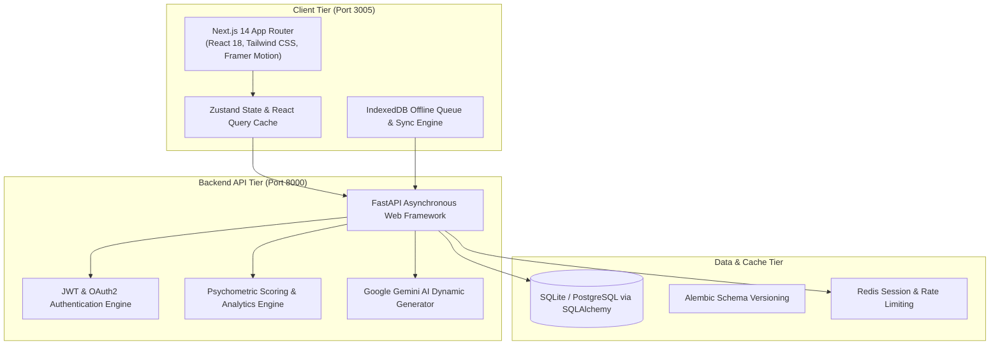

<div align="center">

# 🧠 Soul Sense EQ Test & Emotional Intelligence Platform

[GitHub Repository](https://github.com/nupurmadaan04/SOUL_SENSE_EXAM)

**A comprehensive Emotional Intelligence assessment and wellbeing platform with AI-powered psychometrics, journaling, sentiment analytics, and desktop cross-platform support.**

[](https://www.python.org/)
[](https://nextjs.org/)
[](https://fastapi.tiangolo.com/)
[](LICENSE)
[](tests/)

</div>

---

## 📋 Table of Contents

- [Overview](#-overview)
- [Architecture & Tech Stack](#-architecture--tech-stack)
- [Key Features](#-key-features)
- [Local Setup & Quick Start](#-local-setup--quick-start)
- [Application Routes & Workflow](#-application-routes--workflow)
- [API Reference](#-api-reference)
- [Testing & Quality Assurance](#-testing--quality-assurance)
- [Security & Privacy](#-security--privacy)
- [License](#-license)

---

## 🎯 Overview

**Soul Sense** is a full-stack psychometric assessment and emotional wellbeing platform that combines evidence-based psychological frameworks with real-time AI capabilities. 

Built with **Next.js 14** (App Router), **FastAPI**, **SQLite/PostgreSQL**, and **Gemini AI**, it delivers structured Emotional Quotient (EQ) evaluations, personalized psychometric question generation, sentiment-aware daily journaling, and actionable wellness insights.

### Core Pillars

- **Evidence-Based Psychometrics**: Grounded in the 5 Core Emotional Intelligence domains (Daniel Goleman Model & Salovey-Mayer framework).
- **Gemini AI Dynamic Custom Assessments**: Real-time psychometric question generation synthesized from user stressors, goals, and tone preferences.
- **4-Point Likert Scoring Engine**: Clear forced-choice evaluation (*Strongly Disagree*, *Disagree*, *Agree*, *Strongly Agree*) for unambiguous alignment scoring.
- **Mindful Expressive Journaling**: Daily mood tracking, reflective journaling, and NLTK/VADER sentiment analysis.
- **Privacy-First Architecture**: End-to-end user encryption, localized SQLite storage, offline sync queues, and zero-data-loss protections.

---

## 🏗️ Architecture & Tech Stack


```mermaid
graph TB
    subgraph Frontend["Client Tier (Port 3005)"]
        UI["Next.js 14 App Router\n(React 18, Tailwind CSS, Framer Motion)"]
        State["Zustand State & React Query Cache"]
        Offline["IndexedDB Offline Queue & Sync Engine"]
    end

    subgraph Backend["Backend API Tier (Port 8000)"]
        FastAPI["FastAPI Asynchronous Web Framework"]
        Auth["JWT & OAuth2 Authentication Engine"]
        Psychometrics["Psychometric Scoring & Analytics Engine"]
        Gemini["Google Gemini AI Dynamic Generator"]
    end

    subgraph Storage["Data & Cache Tier"]
        DB[(SQLite / PostgreSQL via SQLAlchemy)]
        Migrations["Alembic Schema Versioning"]
        Redis["Redis Session & Rate Limiting"]
    end

    UI --> State
    State --> FastAPI
    Offline --> FastAPI
    FastAPI --> Auth
    FastAPI --> Psychometrics
    FastAPI --> Gemini
    FastAPI --> DB
    FastAPI --> Redis
```

---

## ✨ Key Features

1. **Personalized Assessment Hub**:
   - 5 standard psychometric domains: Self-Awareness, Self-Regulation, Motivation, Empathy, and Social Skills.
   - Dynamic AI custom assessments generated in real-time based on life events and cognitive focus areas.
   - 4-point Likert scale questions with instant percentage score computation.

2. **Personal Emotional Dashboard**:
   - 7-day mood check-in tracking with dynamic unfilled/filled state indicators.
   - Interactive Emotional Trend graph with date range and sentiment filtering.
   - AI-recommended wellness insights and quick-action mindfulness exercises.

3. **Daily Journal & Mood Reflections**:
   - Expressive writing journal with sentiment scoring, stress indicators, and sleep/energy correlation.
   - Automatic prompt suggestions tailored to recent assessment outcomes.

4. **User Profile & Customization**:
   - Interactive avatar and photo upload with client-side preview and caching.
   - Focus area configuration, sleep/diet context, and support goal preferences.

5. **Settings, Security & Support**:
   - System theme switcher (Light, Dark, and System).
   - Dedicated Support & FAQ hub (`/settings#support`) with direct bug reporting and developer links.
   - Full JSON, CSV, and PDF report export generation.

---

## 🚀 Local Setup & Quick Start

### Prerequisites
- **Python 3.10+**
- **Node.js 18+** & **npm**
- **Git**

### 1. Clone the Repository
```bash
git clone https://github.com/nupurmadaan04/SOUL_SENSE_EXAM.git
cd SOUL_SENSE_EXAM
```

### 2. Backend Setup (FastAPI)
```bash
# Create and activate virtual environment (optional)
python -m venv .venv
source .venv/bin/activate  # On Windows: .venv\Scripts\activate

# Install dependencies
pip install -r requirements.txt

# Run database migrations
alembic upgrade head

# Seed question bank
python scripts/setup/seed_questions_v2.py

# Start FastAPI backend server
python -m uvicorn api.main:app --host 127.0.0.1 --port 8000 --reload
```
Interactive API documentation: `http://localhost:8000/docs`

### 3. Frontend Setup (Next.js)
```bash
cd frontend-web

# Install dependencies
npm install

# Start Next.js development server
npm run dev
```
Web Application UI: `http://localhost:3005`

### 4. Desktop Application (Optional)
```bash
python -m app.main
```

---

## 🗺️ Application Routes & Workflow

| Route | Name | Purpose |
| :--- | :--- | :--- |
| **`/`** | Landing Page | Feature showcase, psychological science overview, and onboarding |
| **`/login`** | Sign In | Secure JWT authentication with session protection |
| **`/register`** | Registration | User account registration |
| **`/dashboard`** | Dashboard | Emotional trend graphs, 7-day mood tracker, and Assessment Hub |
| **`/exam`** | Assessment | 4-point Likert psychometric examination runner |
| **`/results`** | Results & Analytics | EQ score breakdown, category radars, and growth recommendations |
| **`/journal`** | Journal | Daily emotional reflections and sentiment history |
| **`/profile`** | User Profile | Personal details, focus areas, and avatar photo management |
| **`/settings`** | Settings & Support | Preferences, privacy controls, FAQs, and developer support |

---

## 🧪 Testing & Quality Assurance

```bash
# Run backend pytest suite
pytest tests/ -v

# Run frontend tests
cd frontend-web
npm test
```

---

## 🔒 Security & Privacy

- **Data Encryption**: Multi-layer password hashing with `bcrypt` and signed JWT session tokens.
- **Zero Data Loss**: Offline sync queue storing journal entries and exam responses locally until connectivity is restored.
- **CORS & Rate Limiting**: Strict domain whitelisting and request throttling on all public endpoints.
- **Privacy Controls**: Granular user consent for analytics and AI psychometric synthesis.

---

## 📄 License

This project is licensed under the [MIT License](LICENSE).
