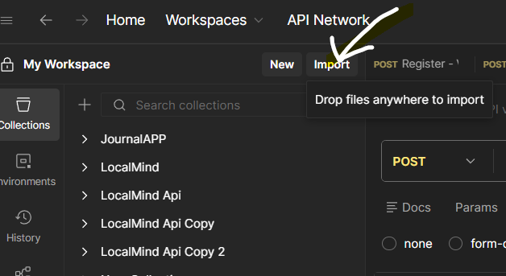

# SoulSense API v1 - Postman Test Suite

## Quick Start

1. **Import Collection**: File → Import → `SoulSense_API_v1.postman_collection.json`

2. **Import Environment**: File → Import → `SoulSense_API_v1.postman_environment.json`

Copy - Paste Json code 

3. **Select Environment**: Choose "SoulSense API v1" from dropdown (top-right)
4. **Start Server**: Run `python backend/fastapi/start_server.py`

## Test Coverage (28 Tests)

| Folder        | Tests | Coverage                                                                                                          |
| ------------- | ----- | ----------------------------------------------------------------------------------------------------------------- |
| Auth          | 7     | Register (valid, short username, weak password, missing fields), Login (valid, wrong password, non-existent user) |
| Users         | 3     | GET /me (authenticated, no token, invalid token)                                                                  |
| Journal       | 5     | POST (valid, short content, invalid privacy), GET (paginated, analytics)                                          |
| Profiles      | 5     | GET settings, medical, personal, strengths, emotional                                                             |
| Settings Sync | 2     | GET all, PUT /theme upsert                                                                                        |
| Assessments   | 2     | GET list, stats                                                                                                   |
| Questions     | 2     | GET list, categories                                                                                              |
| Analytics     | 1     | GET summary                                                                                                       |
| Health        | 1     | GET health check                                                                                                  |

## Running Tests

### Run All Tests

1. Right-click "SoulSense API v1 - Test Suite" → Run Collection
2. Review test results in the runner window

### Auto-Authentication Flow

1. Run "Auth → Register - Valid" to create a test user
2. Run "Auth → Login - Valid" - token is auto-saved to `{{access_token}}`
3. All authenticated requests now use the saved token automatically

## Variables

| Variable        | Description                                            |
| --------------- | ------------------------------------------------------ |
| `base_url`      | API base URL (default: `http://localhost:8000/api/v1`) |
| `access_token`  | JWT token (auto-populated on login)                    |
| `test_username` | Dynamic username for registration tests                |
