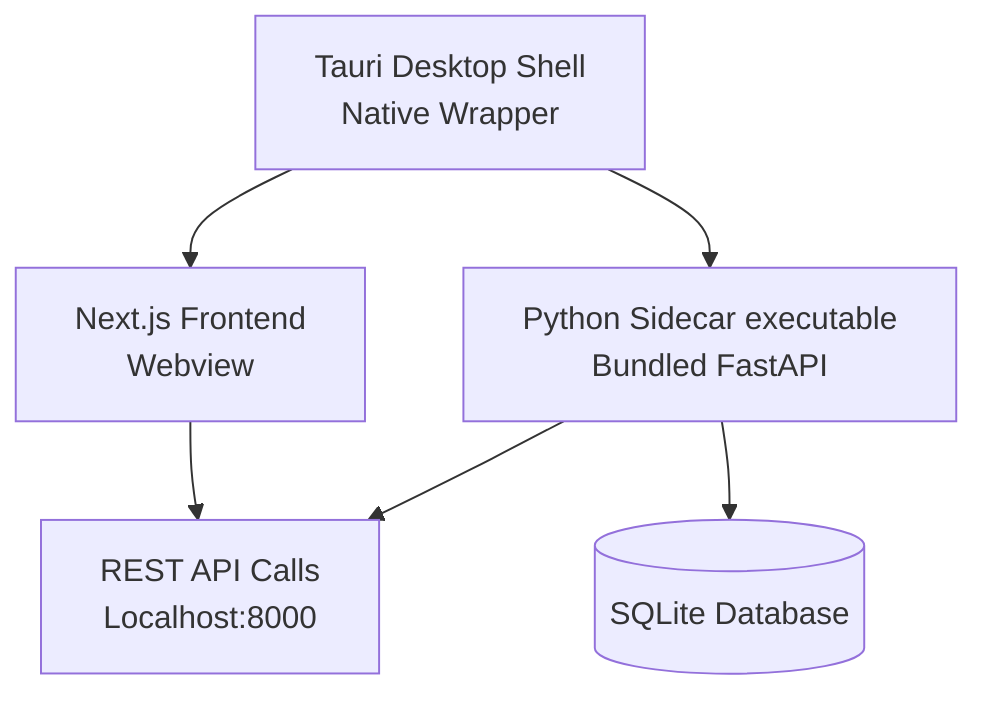

### 🧠 Soul Sense EQ Test — System Architecture

# Overview

Soul Sense EQ Test is a desktop-based Emotional Intelligence (EQ) assessment system built using Python, Tkinter, and SQLite.
The architecture prioritizes:

- Clear separation of concerns

- Testability and maintainability

- Safe local persistence

- Incremental extensibility toward ML-powered insights

The system follows a layered architecture with the GUI acting as a thin interaction layer over decoupled business and data logic.

#

# High-Level Architecture

The system supports two frontend experiences: a legacy Tkinter interface and a modern Tauri-based desktop shell.

### Modern Desktop Shell (Tauri)



### Legacy Desktop App (Tkinter)

```bash
┌────────────────────┐
│   Tkinter GUI      │
│  (Presentation)   │
└────────┬──────────┘
         │
┌────────▼──────────┐
│ Application Logic │
│ (Auth, EQ,        │
│ Journal, Utils)   │
└────────┬──────────┘
         │
┌────────▼──────────┐
│ Data Access Layer │
│ (SQLite + Models) │
└────────┬──────────┘
         │
┌────────▼──────────┐
│   SQLite DB       │
│ (Local Storage)  │
└──────────────────┘

```

# GUI Layer (Tkinter)

Location: `app/main.py`

**Responsibilities:**

- Rendering application windows and views
- Managing navigation between screens (Login, Test, Results, Journal)
- Capturing user input
- Displaying scores, interpretations, and insights

**Design principles:**

- No direct database access
- No business logic embedded in UI widgets
- All logic delegated to application modules

Typical GUI Flow:

```bash
Login / Sign Up
      ↓
EQ Test
      ↓
Score Interpretation
      ↓
Journal (Optional)
      ↓
Logout
```

#

# Application Logic Layer

This layer contains the core business logic and domain rules.

### Authentication

Location: `app/auth.py`

- User registration and login
- Password hashing using SHA-256
- Session lifecycle management
- User-specific data isolation

### EQ Test Logic

- Question retrieval from the database
- Likert-scale response handling
- EQ score computation
- Score interpretation mapping

### Journal & Emotional Analysis

- Daily emotional reflection storage
- Sentiment scoring of journal entries
- Pattern detection (stress indicators, growth mindset, self-reflection)
- Emotional trend tracking over time

### Shared Utilities

Location: `app/utils.py`

- Validation helpers
- Common formatting logic
- Reusable constants and helpers

#

# Data Access Layer

### Database Management

Location: `app/db.py`

- Centralized SQLite connection handling
- Runtime-safe schema initialization
- Backward-compatible schema migrations
- Transaction safety and consistency

### Models

Location: `app/models.py`

- Declarative database models for:
  - Users
  - Questions
  - Responses
  - Scores
  - Journal entries

SQLite remains the authoritative persistence layer for simplicity and portability.

#

# Migrations

Tool: Alembic
Location: migrations/

Responsibilities:

- Controlled schema evolution
- Safe upgrades without data loss
- Versioned migration scripts

Migration strategy:

- Backward-compatible changes only
- No destructive operations
- Explicit version control

# Question Loading Architecture

Script: `scripts/load_questions.py`
Source: `data/questions.txt`

Key properties:

- One-time execution
- Idempotent loading
- Questions become read-only at runtime
- Ensures consistent scoring behavior

#

# Data Flow

EQ Test Flow

```bash
User Input
  ↓
GUI Event
  ↓
Application Logic
  ↓
Score Calculation
  ↓
SQLite Persistence
  ↓
Result Interpretation
```

Journal Flow

```bash
User Entry
  ↓
Sentiment Analysis
  ↓
Pattern Detection
  ↓
Database Storage
  ↓
Historical Trend View
```

#

# Testing Architecture

Framework: Pytest
Location: `tests/`

Testing characteristics:

- GUI-independent tests
- Temporary SQLite databases
- Isolated and deterministic test cases

Coverage includes:

- Authentication flows
- Database migrations
- EQ scoring logic

Journal persistence and analysis

#

# Future ML Integration

The architecture supports incremental machine learning integration without structural changes.

Planned integration areas:

- ML-based sentiment classification
- Emotional trend modeling
- Stress and anomaly detection
- Personalized reflection and EQ growth recommendations

Integration strategy:

- ML logic isolated in dedicated modules
- No GUI coupling
- No breaking schema changes
