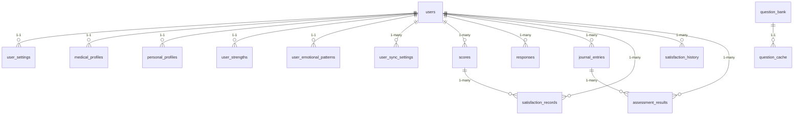

# Database Schema Documentation

This document describes the database schema for the SoulSense application, based on the SQLAlchemy models defined in `app/models.py`.

## Overview

The SoulSense application uses SQLite as its database backend. The schema is defined using SQLAlchemy ORM models and includes tables for users, assessments, journal entries, and various profile information.

## Database Configuration

- **Database Type**: SQLite
- **Database File**: `soulsense.db` (located in `data/` directory)
- **ORM**: SQLAlchemy
- **Migration Tool**: Alembic

## Tables and Relationships

### Core Tables

#### 1. users
Primary user table containing authentication and basic user information.

| Field | Type | Constraints | Description |
|-------|------|-------------|-------------|
| id | INTEGER | PRIMARY KEY, AUTOINCREMENT | Unique user identifier |
| username | VARCHAR | UNIQUE, NOT NULL | User's login username |
| password_hash | VARCHAR | NOT NULL | Hashed password for authentication |
| created_at | VARCHAR | DEFAULT current timestamp | Account creation timestamp |
| last_login | VARCHAR | NULL | Last login timestamp |

**Relationships:**
- One-to-one with `user_settings`
- One-to-one with `medical_profiles`
- One-to-one with `personal_profiles`
- One-to-one with `user_strengths`
- One-to-one with `user_emotional_patterns`
- One-to-many with `scores`
- One-to-many with `responses`
- One-to-many with `user_sync_settings`

#### 2. user_settings
User-specific application settings.

| Field | Type | Constraints | Description |
|-------|------|-------------|-------------|
| id | INTEGER | PRIMARY KEY, AUTOINCREMENT | Settings record ID |
| user_id | INTEGER | FOREIGN KEY(users.id), UNIQUE, NOT NULL | Reference to user |
| theme | VARCHAR | DEFAULT 'light' | UI theme preference |
| question_count | INTEGER | DEFAULT 10 | Number of questions per assessment |
| sound_enabled | BOOLEAN | DEFAULT True | Sound effects enabled |
| notifications_enabled | BOOLEAN | DEFAULT True | Push notifications enabled |
| language | VARCHAR | DEFAULT 'en' | Preferred language |
| updated_at | VARCHAR | DEFAULT current timestamp | Last update timestamp |

#### 3. medical_profiles
Medical information and health-related data.

| Field | Type | Constraints | Description |
|-------|------|-------------|-------------|
| id | INTEGER | PRIMARY KEY, AUTOINCREMENT | Profile record ID |
| user_id | INTEGER | FOREIGN KEY(users.id), UNIQUE, NOT NULL | Reference to user |
| blood_type | VARCHAR | NULL | User's blood type |
| allergies | TEXT | NULL | JSON string of allergies |
| medications | TEXT | NULL | JSON string of medications |
| medical_conditions | TEXT | NULL | JSON string of conditions |
| surgeries | TEXT | NULL | History of surgeries |
| therapy_history | TEXT | NULL | Past therapy/counseling |
| ongoing_health_issues | TEXT | NULL | Current health issues |
| emergency_contact_name | VARCHAR | NULL | Emergency contact name |
| emergency_contact_phone | VARCHAR | NULL | Emergency contact phone |
| last_updated | VARCHAR | DEFAULT current timestamp | Last update timestamp |

#### 4. personal_profiles
Personal and demographic information.

| Field | Type | Constraints | Description |
|-------|------|-------------|-------------|
| id | INTEGER | PRIMARY KEY, AUTOINCREMENT | Profile record ID |
| user_id | INTEGER | FOREIGN KEY(users.id), UNIQUE, NOT NULL | Reference to user |
| occupation | VARCHAR | NULL | User's occupation |
| education | VARCHAR | NULL | Education level |
| marital_status | VARCHAR | NULL | Marital status |
| hobbies | TEXT | NULL | JSON string of hobbies |
| bio | TEXT | NULL | User biography |
| life_events | TEXT | NULL | JSON array of life events |
| email | VARCHAR | NULL | Contact email |
| phone | VARCHAR | NULL | Contact phone |
| date_of_birth | VARCHAR | NULL | Date of birth (YYYY-MM-DD) |
| gender | VARCHAR | NULL | Gender identity |
| address | TEXT | NULL | Physical address |
| society_contribution | TEXT | NULL | Community contributions |
| life_pov | TEXT | NULL | Life philosophy/perspective |
| high_pressure_events | TEXT | NULL | Recent stressful events |
| avatar_path | VARCHAR | NULL | Path to profile avatar |
| last_updated | VARCHAR | DEFAULT current timestamp | Last update timestamp |

#### 5. user_strengths
User's strengths, areas for improvement, and preferences.

| Field | Type | Constraints | Description |
|-------|------|-------------|-------------|
| id | INTEGER | PRIMARY KEY, AUTOINCREMENT | Strengths record ID |
| user_id | INTEGER | FOREIGN KEY(users.id), UNIQUE, NOT NULL | Reference to user |
| top_strengths | TEXT | DEFAULT '[]' | JSON array of strengths |
| areas_for_improvement | TEXT | DEFAULT '[]' | JSON array of improvement areas |
| current_challenges | TEXT | DEFAULT '[]' | JSON array of challenges |
| learning_style | VARCHAR | NULL | Preferred learning style |
| communication_preference | VARCHAR | NULL | Communication style preference |
| comm_style | TEXT | NULL | Detailed communication style |
| sharing_boundaries | TEXT | DEFAULT '[]' | JSON array of boundaries |
| goals | TEXT | NULL | User's goals |
| last_updated | VARCHAR | DEFAULT current timestamp | Last update timestamp |

#### 6. user_emotional_patterns
User's emotional patterns and coping strategies.

| Field | Type | Constraints | Description |
|-------|------|-------------|-------------|
| id | INTEGER | PRIMARY KEY, AUTOINCREMENT | Patterns record ID |
| user_id | INTEGER | FOREIGN KEY(users.id), UNIQUE, NOT NULL | Reference to user |
| common_emotions | TEXT | DEFAULT '[]' | JSON array of common emotions |
| emotional_triggers | TEXT | NULL | Description of triggers |
| coping_strategies | TEXT | NULL | Coping mechanisms |
| preferred_support | VARCHAR | NULL | Preferred support style |
| last_updated | VARCHAR | DEFAULT current timestamp | Last update timestamp |

#### 7. user_sync_settings
Key-value store for user-specific sync settings.

| Field | Type | Constraints | Description |
|-------|------|-------------|-------------|
| id | INTEGER | PRIMARY KEY, AUTOINCREMENT | Setting record ID |
| user_id | INTEGER | FOREIGN KEY(users.id), NOT NULL | Reference to user |
| key | VARCHAR(100) | NOT NULL | Setting key |
| value | TEXT | NULL | JSON-serialized value |
| version | INTEGER | DEFAULT 1, NOT NULL | Version for conflict detection |
| created_at | VARCHAR | DEFAULT current timestamp | Creation timestamp |
| updated_at | VARCHAR | DEFAULT current timestamp | Last update timestamp |

**Indexes:**
- `idx_sync_user_key` (user_id, key) - UNIQUE

### Assessment Tables

#### 8. scores
Emotional intelligence assessment results.

| Field | Type | Constraints | Description |
|-------|------|-------------|-------------|
| id | INTEGER | PRIMARY KEY, AUTOINCREMENT | Score record ID |
| username | VARCHAR | INDEX | Username (for legacy compatibility) |
| total_score | INTEGER | INDEX | Total EQ assessment score |
| sentiment_score | FLOAT | DEFAULT 0.0 | NLTK sentiment analysis score |
| reflection_text | TEXT | NULL | Open-ended reflection response |
| is_rushed | BOOLEAN | DEFAULT False | Whether answers were rushed |
| is_inconsistent | BOOLEAN | DEFAULT False | Whether answers were inconsistent |
| age | INTEGER | INDEX | User's age at assessment |
| detailed_age_group | VARCHAR | INDEX | Detailed age categorization |
| user_id | INTEGER | FOREIGN KEY(users.id), NULL, INDEX | Reference to user |
| timestamp | VARCHAR | DEFAULT current timestamp, INDEX | Assessment timestamp |

**Relationships:**
- Many-to-one with `users`

**Indexes:**
- `idx_score_username_timestamp` (username, timestamp)
- `idx_score_user_timestamp` (user_id, timestamp)
- `idx_score_age_score` (age, total_score)
- `idx_score_agegroup_score` (detailed_age_group, total_score)

#### 9. responses
Individual question responses from assessments.

| Field | Type | Constraints | Description |
|-------|------|-------------|-------------|
| id | INTEGER | PRIMARY KEY, AUTOINCREMENT | Response record ID |
| username | VARCHAR | INDEX | Username (for legacy compatibility) |
| question_id | INTEGER | INDEX | Reference to question |
| response_value | INTEGER | INDEX | Numerical response value |
| age_group | VARCHAR | INDEX | Age group categorization |
| detailed_age_group | VARCHAR | INDEX | Detailed age categorization |
| timestamp | VARCHAR | DEFAULT current timestamp, INDEX | Response timestamp |
| user_id | INTEGER | FOREIGN KEY(users.id), NULL, INDEX | Reference to user |

**Relationships:**
- Many-to-one with `users`

**Indexes:**
- `idx_response_user_question` (user_id, question_id)
- `idx_response_username_timestamp` (username, timestamp)
- `idx_response_question_timestamp` (question_id, timestamp)
- `idx_response_user_timestamp` (user_id, timestamp)
- `idx_response_agegroup_timestamp` (detailed_age_group, timestamp)

### Question Bank Tables

#### 10. question_bank
Question definitions for assessments.

| Field | Type | Constraints | Description |
|-------|------|-------------|-------------|
| id | INTEGER | PRIMARY KEY, AUTOINCREMENT | Question ID |
| question_text | VARCHAR | NOT NULL | The question text |
| category_id | INTEGER | NOT NULL | Reference to category |
| difficulty | INTEGER | NOT NULL | Difficulty level |
| is_active | INTEGER | DEFAULT 1 | Whether question is active |
| min_age | INTEGER | DEFAULT 0 | Minimum age for question |
| max_age | INTEGER | DEFAULT 120 | Maximum age for question |
| weight | FLOAT | DEFAULT 1.0 | Question weighting factor |
| tooltip | TEXT | NULL | Help text for question |
| created_at | VARCHAR | DEFAULT current timestamp | Creation timestamp |

#### 11. question_category
Question categories for organization.

| Field | Type | Constraints | Description |
|-------|------|-------------|-------------|
| id | INTEGER | PRIMARY KEY, AUTOINCREMENT | Category ID |
| name | VARCHAR | NOT NULL | Category name |

### Journal Tables

#### 12. journal_entries
User journal entries and daily reflections.

| Field | Type | Constraints | Description |
|-------|------|-------------|-------------|
| id | INTEGER | PRIMARY KEY, AUTOINCREMENT | Journal entry ID |
| username | VARCHAR | NOT NULL | Username (for legacy compatibility) |
| user_id | INTEGER | FOREIGN KEY(users.id), NULL | Reference to user |
| entry_date | VARCHAR | DEFAULT current timestamp | Entry date/time |
| content | TEXT | NOT NULL | Journal content |
| sentiment_score | FLOAT | NOT NULL | Sentiment analysis score |
| emotional_patterns | TEXT | NULL | Detected emotional patterns |
| sleep_hours | FLOAT | NULL | Hours of sleep |
| sleep_quality | INTEGER | NULL | Sleep quality (1-10) |
| energy_level | INTEGER | NULL | Energy level (1-10) |
| work_hours | FLOAT | NULL | Hours worked |
| screen_time_mins | INTEGER | NULL | Screen time in minutes |
| stress_level | INTEGER | NULL | Stress level (1-10) |
| stress_triggers | TEXT | NULL | What caused stress |
| daily_schedule | TEXT | NULL | Daily schedule description |
| tags | TEXT | NULL | JSON array of tags |
| is_deleted | BOOLEAN | DEFAULT False | Soft delete flag |
| privacy_level | VARCHAR | DEFAULT 'private' | Privacy setting |
| word_count | INTEGER | DEFAULT 0 | Word count of entry |

### Satisfaction Tracking Tables

#### 13. satisfaction_records
Work/academic satisfaction assessments.

| Field | Type | Constraints | Description |
|-------|------|-------------|-------------|
| id | INTEGER | PRIMARY KEY, AUTOINCREMENT | Satisfaction record ID |
| user_id | INTEGER | FOREIGN KEY(users.id), INDEX, NULL | Reference to user |
| username | VARCHAR | INDEX | Username (for legacy compatibility) |
| timestamp | VARCHAR | DEFAULT current timestamp, INDEX | Assessment timestamp |
| satisfaction_score | INTEGER | INDEX | Satisfaction score (1-10) |
| satisfaction_category | VARCHAR | INDEX | Category (work/academic/both/other) |
| positive_factors | TEXT | NULL | JSON array of positive factors |
| negative_factors | TEXT | NULL | JSON array of negative factors |
| improvement_suggestions | TEXT | NULL | Improvement suggestions |
| context | VARCHAR | NULL | Work/school context |
| duration_months | INTEGER | NULL | Duration in role/studies |
| eq_score_id | INTEGER | FOREIGN KEY(scores.id), NULL, INDEX | Link to EQ assessment |

**Indexes:**
- `idx_satisfaction_user_time` (user_id, timestamp)
- `idx_satisfaction_category_score` (satisfaction_category, satisfaction_score)
- `idx_satisfaction_context` (context, satisfaction_score)

#### 14. satisfaction_history
Historical satisfaction trends.

| Field | Type | Constraints | Description |
|-------|------|-------------|-------------|
| id | INTEGER | PRIMARY KEY, AUTOINCREMENT | History record ID |
| user_id | INTEGER | FOREIGN KEY(users.id), INDEX, NOT NULL | Reference to user |
| month_year | VARCHAR | INDEX | Month-year (YYYY-MM) |
| avg_satisfaction | FLOAT | NOT NULL | Average satisfaction score |
| trend | VARCHAR | NOT NULL | Trend direction |
| insights | TEXT | NULL | Generated insights |

**Indexes:**
- `idx_satisfaction_history_user_month` (user_id, month_year)

### Assessment Results Tables

#### 15. assessment_results
Results from specialized assessments.

| Field | Type | Constraints | Description |
|-------|------|-------------|-------------|
| id | INTEGER | PRIMARY KEY, AUTOINCREMENT | Assessment result ID |
| user_id | INTEGER | FOREIGN KEY(users.id), NOT NULL, INDEX | Reference to user |
| assessment_type | VARCHAR | NOT NULL, INDEX | Assessment type |
| timestamp | VARCHAR | DEFAULT current timestamp, INDEX | Assessment timestamp |
| total_score | INTEGER | NOT NULL | Total assessment score |
| details | TEXT | NOT NULL | JSON string of detailed results |
| journal_entry_id | INTEGER | FOREIGN KEY(journal_entries.id), NULL | Linked journal entry |

**Indexes:**
- `idx_assessment_user_type` (user_id, assessment_type)

### Performance and Caching Tables

#### 16. question_cache
Cache for frequently accessed questions.

| Field | Type | Constraints | Description |
|-------|------|-------------|-------------|
| id | INTEGER | PRIMARY KEY, AUTOINCREMENT | Cache entry ID |
| question_id | INTEGER | FOREIGN KEY(question_bank.id), UNIQUE, INDEX | Reference to question |
| question_text | TEXT | NOT NULL | Cached question text |
| category_id | INTEGER | INDEX | Cached category ID |
| difficulty | INTEGER | INDEX | Cached difficulty |
| is_active | INTEGER | DEFAULT 1, INDEX | Cached active status |
| min_age | INTEGER | DEFAULT 0 | Cached minimum age |
| max_age | INTEGER | DEFAULT 120 | Cached maximum age |
| tooltip | TEXT | NULL | Cached tooltip |
| cached_at | VARCHAR | DEFAULT current timestamp | Cache timestamp |
| access_count | INTEGER | DEFAULT 0, INDEX | Access counter |

**Indexes:**
- `idx_cache_active_difficulty` (is_active, difficulty)
- `idx_cache_category_active` (category_id, is_active)
- `idx_cache_access_time` (access_count, cached_at)

#### 17. statistics_cache
Cache for computed statistics.

| Field | Type | Constraints | Description |
|-------|------|-------------|-------------|
| id | INTEGER | PRIMARY KEY, AUTOINCREMENT | Cache entry ID |
| stat_name | VARCHAR | UNIQUE, INDEX | Statistic name |
| stat_value | FLOAT | NOT NULL | Computed value |
| stat_json | TEXT | NULL | Complex statistic data |
| calculated_at | VARCHAR | DEFAULT current timestamp | Calculation timestamp |
| valid_until | VARCHAR | INDEX | Cache expiration |

**Indexes:**
- `idx_stats_name_valid` (stat_name, valid_until)

## Database Relationships



## Example Queries

### Get User Profile with All Related Data
```sql
SELECT u.username, u.created_at,
       mp.blood_type, mp.allergies,
       pp.occupation, pp.education,
       us.theme, us.language,
       ustr.top_strengths, ustr.goals,
       uep.common_emotions, uep.coping_strategies
FROM users u
LEFT JOIN medical_profiles mp ON u.id = mp.user_id
LEFT JOIN personal_profiles pp ON u.id = pp.user_id
LEFT JOIN user_settings us ON u.id = us.user_id
LEFT JOIN user_strengths ustr ON u.id = ustr.user_id
LEFT JOIN user_emotional_patterns uep ON u.id = uep.user_id
WHERE u.id = ?;
```

### Get Recent Assessment Scores
```sql
SELECT s.total_score, s.sentiment_score, s.timestamp,
       s.age, s.detailed_age_group,
       u.username
FROM scores s
JOIN users u ON s.user_id = u.id
WHERE s.user_id = ?
ORDER BY s.timestamp DESC
LIMIT 10;
```

### Get Journal Entries with Emotional Analysis
```sql
SELECT je.entry_date, je.content, je.sentiment_score,
       je.sleep_hours, je.energy_level, je.stress_level,
       je.tags, je.privacy_level
FROM journal_entries je
WHERE je.user_id = ? AND je.is_deleted = 0
ORDER BY je.entry_date DESC
LIMIT 50;
```

### Get Satisfaction Trends
```sql
SELECT sh.month_year, sh.avg_satisfaction, sh.trend, sh.insights
FROM satisfaction_history sh
WHERE sh.user_id = ?
ORDER BY sh.month_year DESC;
```

### Get Active Questions for Assessment
```sql
SELECT qb.id, qb.question_text, qb.category_id,
       qb.difficulty, qb.weight, qb.tooltip,
       qc.name as category_name
FROM question_bank qb
JOIN question_category qc ON qb.category_id = qc.id
WHERE qb.is_active = 1
  AND ? BETWEEN qb.min_age AND qb.max_age
ORDER BY qb.difficulty, qb.id;
```

## Performance Optimizations

The database includes several performance optimizations:

1. **Indexes**: Comprehensive indexing on frequently queried columns
2. **Composite Indexes**: Multi-column indexes for complex queries
3. **Caching Tables**: `question_cache` and `statistics_cache` for frequently accessed data
4. **Full-Text Search**: FTS5 virtual table for question search (`question_search`)
5. **SQLite Optimizations**: WAL mode, optimized cache size, foreign key enforcement

## Data Types and Constraints

- **Timestamps**: Stored as ISO format strings (VARCHAR) for consistency
- **JSON Data**: Stored as TEXT fields containing JSON strings
- **Foreign Keys**: Enforced with cascade delete where appropriate
- **Unique Constraints**: Applied to prevent duplicate relationships
- **Default Values**: Sensible defaults provided for most fields

## Migration and Versioning

Database schema changes are managed through Alembic migrations located in the `migrations/` directory. The `alembic.ini` file contains migration configuration.

## Backup and Recovery

- Regular backups are stored in `data/soulsense.db.bak`
- Corrupted backups are marked with `.corrupt` extension
- The application includes database integrity checking and repair utilities